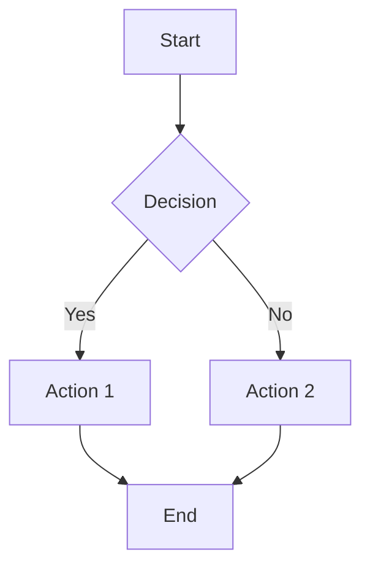
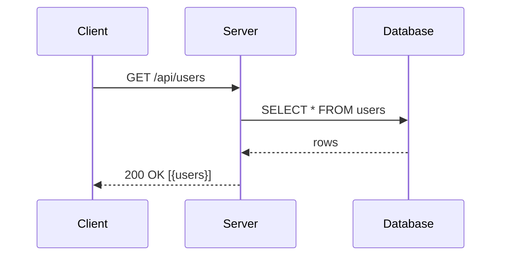
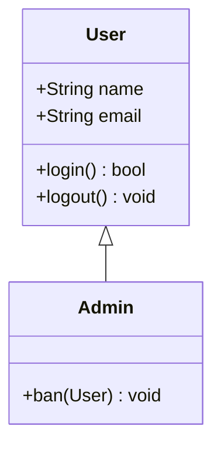
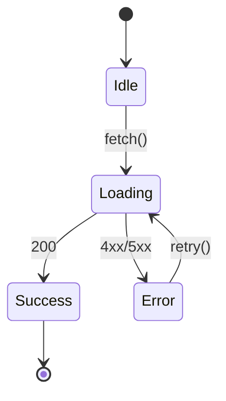
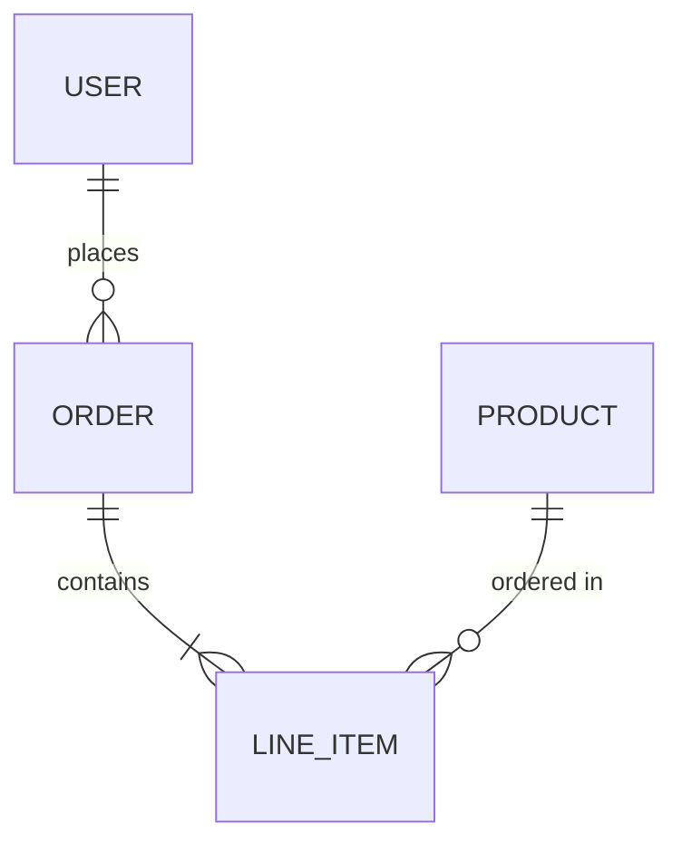
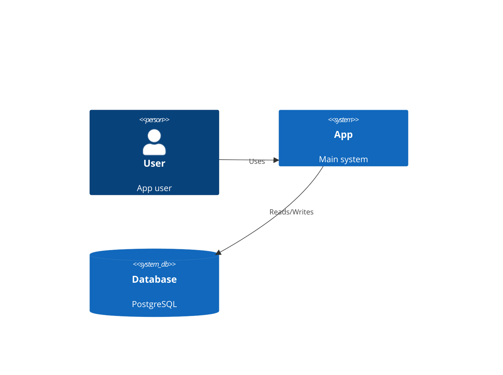
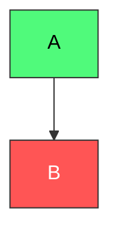

# Mermaid Cheatsheet — Quick Reference

## Flowchart (graph TD / graph LR)

Node shapes: `[rect]` `(rounded)` `{diamond}` `([stadium])` `[[subroutine]]` `[(cylinder)]` `((circle))`

## Sequence Diagram

Arrows: `->>` solid, `-->>` dotted, `-x` cross, `-)` async

## Class Diagram

Relations: `<|--` inherit, `*--` composition, `o--` aggregation, `-->` association

## State Diagram

## Entity Relationship

Cardinality: `||` one, `o{` zero-many, `|{` one-many, `o|` zero-one

## C4 Context (experimental)

## Styling

## Tips
- Use `graph LR` for horizontal, `graph TD` for vertical
- Escape special chars in labels with quotes: `A["Label with (parens)"]`
- Use `subgraph` to group nodes
- Keep diagrams under 20 nodes for readability
